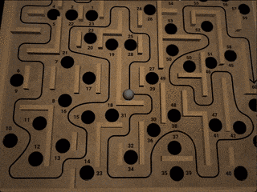

# Labyrinth

Labyrinth is a virtual version of [the classic labyrinth marble game](https://en.wikipedia.org/wiki/Labyrinth_(marble_game)) written in Rust.

[](https://youtu.be/EFMEzvK4WF0)

## Build

First, compile the shaders by installing [glslangValidator](https://www.khronos.org/opengles/sdk/tools/Reference-Compiler/), and running

```
glslangValidator -V -o src/default.frag.spv -e main src/default.frag
glslangValidator -V -o src/default.vert.spv -e main src/default.vert
glslangValidator -V -o src/shadow.vert.spv -e main src/shadow.vert
glslangValidator -V -o src/2d.frag.spv -e main src/2d.frag
glslangValidator -V -o src/2d.vert.spv -e main src/2d.vert
```

in the project main directory.

Then, [install Rust](https://www.rust-lang.org/tools/install), and do

```
cargo build --release
```

in the project main directory.

### Android

Labyrinth can be built for Android using [cargo-mobile](https://github.com/BrainiumLLC/cargo-mobile). The Labyrinth repo doesn't contain any of the files that can be generated by cargo-mobile, so they need to be generated before the build. The process is

1. Create an empty directory and init a cargo-mobile project with name "labyrinth" there using the wgpu template pack
2. Copy the directories ".cargo", "assets" and "gen", and the file "mobile.toml" to Labyrinth main directory
3. Add `android:screenOrientation="landscape"` and `android:theme="@android:style/Theme.NoTitleBar.Fullscreen"` attributes to `activity` element in gen/android/labyrinth/app/src/main/AndroidManifest.xml
4. Follow the cargo-mobile instructions for building the project for Android (in the Labyrinth directory)

## Modules

### `game`

Implements the core game logic and physics. Takes no stance on how the game is presented or how user input is given. Note that even though Labyrinth is a 3D game, the physics in `game` module are 2D.

### `game_loop`

The main game loop: maintains overall application state (game in progress, paused...), handles events, updates game state and the objects in the scene graph, and triggers rendering.

### `graphics`

Implements a scene graph based 3D graphics engine using the [wgpu-rs](https://github.com/gfx-rs/wgpu-rs) library. Not specific to Labyrinth, could in principle be used for other purposes also.

### `ui`

Implements the 2D game UI using the [egui](https://github.com/emilk/egui) library.
